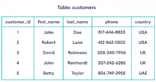

Step 1 - Types of Databases
💡
What all we’ll learn today -
Simple - SQL vs NoSQL, how to create Postgres Databases, How to do CRUD on them
Advance - Relationships, Joins, Transactions
There are a few types of databases, all service different types of use-cases
NoSQL databases 
Store data in a schema-less fashion. Extremely lean and fast way to store data. 
Examples - MongoDB, 
 

 
Graph databases 
Data is stored in the form of a graph. Specially useful in cases where relationships need to be stored (social networks
Examples - Neo4j
 

 
Vector databases
Stores data in the form of vectors
Useful in Machine learning
Examples - Pinecone

 
SQL databases
Stores data in the form of rows
Most full stack applications will use this
Examples - MySQL, Postgres
 
 

Step 2 - Why not NoSQL
 
You might’ve used MongoDB 
It’s schemaless properties make it ideal to for bootstraping a project fast.
But as your app grows, this property makes it very easy for data to get curropted
 
What is schemaless?
Different rows can have different schema (keys/types)

 
Problems?
Can lead to inconsistent database
Can cause runtime errors 
Is too flexible for an app that needs strictness
 
Upsides?
Can move very fast
Can change schema very easily
 
💡
You might think that mongoose does add strictness to the codebase because we used to define a schema there. 
That strictness is present at the Node.js level, not at the DB level. You can still put in erroneous data in the database that doesn’t follow that schema.

Step 3 - Why SQL?
 
SQL databases have a strict schema. They require you to
Define your schema
Put in data that follows that schema
Update the schema as your app changes and perform migrations
 
So there are 4 parts when using an SQL database (not connecting it to Node.js, just running it and putting data in it)
Running the database.
Using a library that let’s you connect and put data in it.
Creating a table and defining it’s schema.
Run queries on the database to interact with the data (Insert/Update/Delete)

// future
error on id 
keys and use