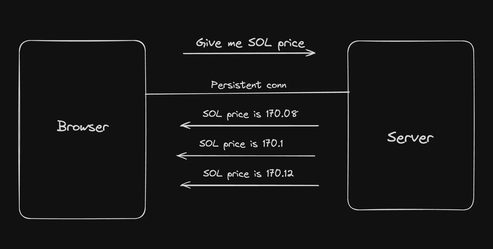
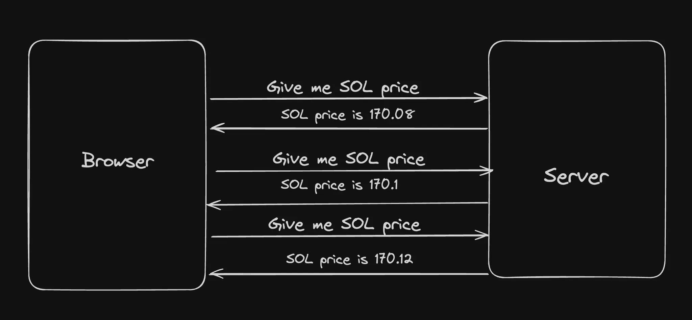
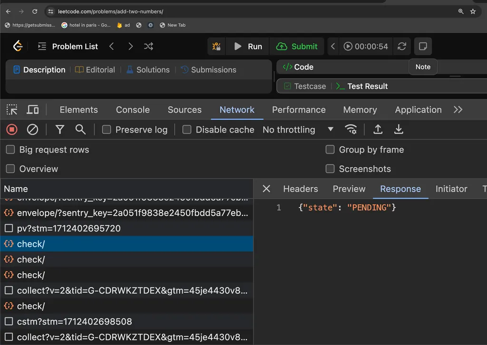
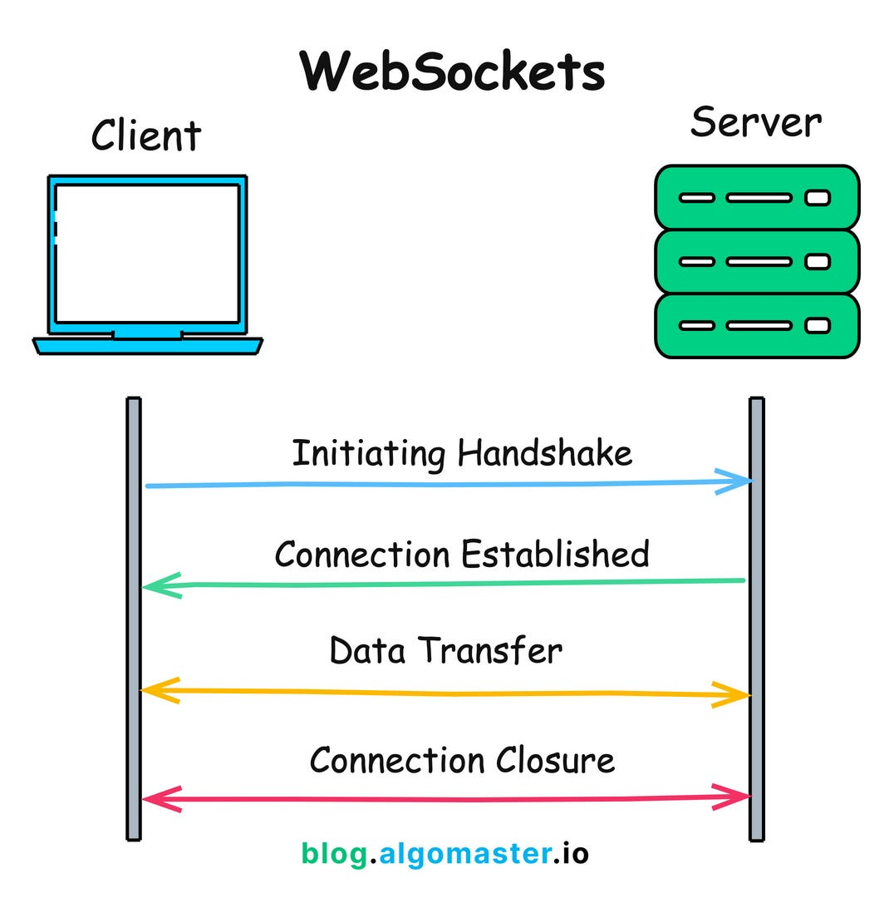
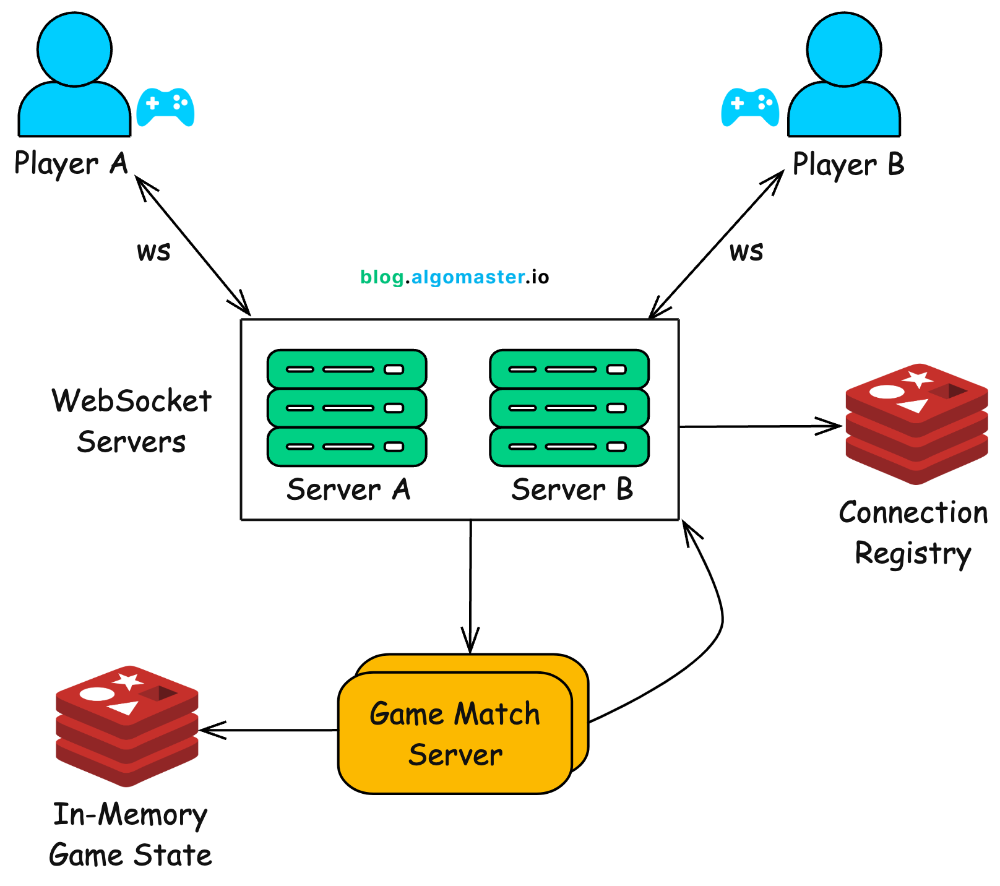

# Websockets

WebSockets provide a way to establish a persistent, full-duplex communication channel over a single 
TCP connection between the client (typically a web browser) and the server.

Good example - https://www.binance.com/en/trade/SOL_USDT?type=spot

### Why not use HTTP/REST? Why do you need ws?

### **Use Cases for WebSockets:**

- **Real-Time Applications**: Chat applications, live sports updates, real-time gaming, and any application requiring instant updates can benefit from WebSockets.
- **Live Feeds**: Financial tickers, news feeds, and social media updates are examples where WebSockets can be used to push live data to users.
- **Interactive Services**: Collaborative editing tools, live customer support chat, and interactive webinars can use WebSockets to enhance user interactio

1. Network Handshake happens for every request
2. No way to push server side events (You can use polling but not the best approach)

simple mai bolu to http mai hame sha handshape hoga to data trasmission slow ho jaata hai 
par websocket mai ak bar connection baan gaya to server and front unlimited baat kar sakte hai
mean to say any multiple request can be end at each point and no delay will be happen  (WebSockets don’t need a separate request for every message — that's why latency becomes extremely low.)
no two way handshake only connect once and then all the communication will be done

❓ Why Not Just Use HTTP / REST? Why Do We Need WebSockets?

HTTP works on a request → response model.
Problems with HTTP:
Network handshake for every request
Client sends request → server responds → connection often closes
Repeated handshakes = extra latency + bandwidth usage.
No true server-side push
Server cannot send data unless the client asks.
Workarounds like:
Polling (asking every X seconds) → ❌ wasteful, delayed
Long polling → better but still ❌ not efficient
Not ideal for real-time updates
If you need updates every second or millisecond (e.g., price charts, games), REST becomes too slow and expensive.

✔ One-time handshake

WebSockets do a handshake only once (HTTP → WebSocket upgrade).
After that, the connection stays open.

✔ Full-duplex communication

Client ↔ Server both can send messages whenever they want.

✔ Zero extra overhead

No repeated HTTP headers, no repeated connections.

✔ Much lower latency

Perfect for applications needing instant updates.

✔ Efficient for high-frequency data

https://petal-estimate-4e9.notion.site/WebSockets-1477dfd10735802982becc925074b5f0